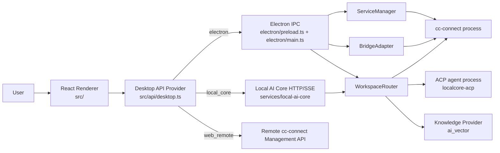
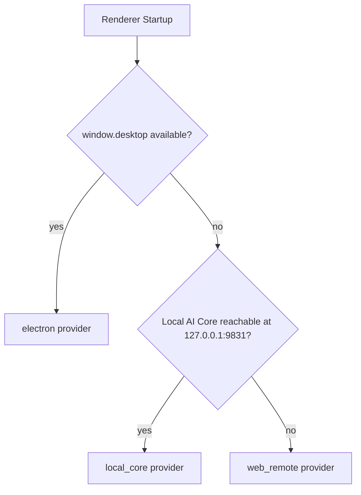
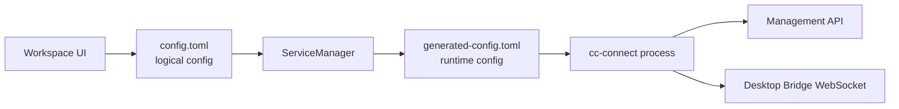
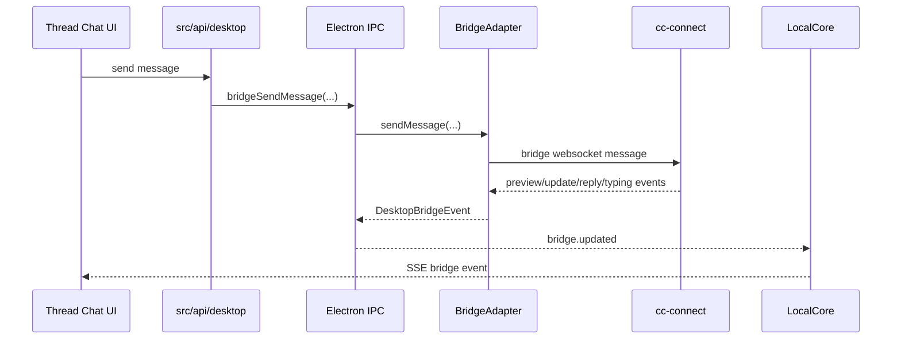
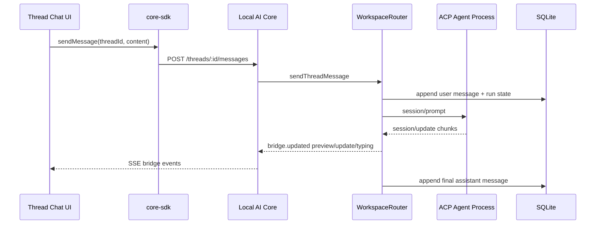

# AI-WorkStation System Architecture

This document summarizes the current architecture of `cc-connect-desktop` from the perspective of runtime ownership, data flow, and subsystem boundaries.

## 1. Goals

AI-WorkStation is evolving from a pure Electron desktop manager for `cc-connect` into a hybrid local app with:

- Electron-managed desktop runtime
- Local AI Core as a local HTTP/SSE facade
- Thread-level routing between `cc-connect` sessions and `localcore-acp` sessions
- Shared renderer code that can run against `electron`, `local_core`, or `web_remote`

## 2. Top-Level Architecture

## 3. Main Layers

### 3.1 Renderer

The renderer lives in `src/` and is a React 19 app bootstrapped from `src/main.tsx`.

Its responsibilities are:

- detect the active runtime provider
- render pages such as Dashboard, Workspace, Threads, Knowledge
- unify thread/chat UX across desktop and local-core modes
- subscribe to runtime and bridge events

Important modules:

- `src/main.tsx`: bootstrap, runtime detection, managed-session initialization
- `src/api/desktop.ts`: provider selection and desktop-facing API facade
- `src/pages/Threads/*`: thread browser, session state, bridge event handling, send/stop/action flows
- `src/pages/Desktop/Workspace.tsx`: config editing, runtime control, ACP probe

### 3.2 Electron Shell

The Electron side lives in `electron/`.

Responsibilities:

- own the native desktop window
- expose a `window.desktop` API through preload
- manage the local `cc-connect` child process
- manage the desktop bridge websocket connection
- host the embedded Local AI Core server

Key files:

- `electron/main.ts`
- `electron/preload.ts`
- `electron/service-manager.ts`
- `electron/bridge-adapter.ts`

### 3.3 Local AI Core

The Local AI Core service lives under `services/local-ai-core/` and acts as a stable local API surface over runtime, threads, knowledge, and SSE events.

Responsibilities:

- expose `/api/local/v1/*`
- stream runtime and bridge events over SSE
- route thread operations by workspace type
- persist `localcore-acp` threads in SQLite

Key files:

- `services/local-ai-core/src/server.ts`
- `services/local-ai-core/src/workspace-router.ts`
- `services/local-ai-core/src/standalone.ts`

### 3.4 Shared Packages

The `packages/` directory provides reusable contracts and adapters:

- `packages/contracts`: shared types for local-core APIs and thread data
- `packages/core-sdk`: browser-side client for Local AI Core
- `packages/adapter-cc-connect`: controller wrapper for standalone local-core mode
- `packages/knowledge-api`: knowledge provider abstraction and `ai_vector` implementation

## 4. Runtime Provider Model

The renderer chooses one of three runtime providers:

- `electron`: use `window.desktop`, but bridge events are normalized through Local AI Core SSE
- `local_core`: use Local AI Core HTTP/SSE directly
- `web_remote`: use remote management APIs only

This selection is centralized in `src/api/desktop.ts` and `src/app/runtime.ts`.

## 5. `cc-connect` Runtime Path

When the app runs in Electron desktop mode, `ServiceManager` owns the lifecycle of the local `cc-connect` binary.

Responsibilities:

- persist user settings
- read and write logical `config.toml`
- derive `generated-config.toml` used at runtime
- assign ports and management tokens
- start/stop/restart the child process
- wait for management API readiness

Important detail:

- logical config is user-facing
- generated runtime config is what `cc-connect` actually starts with
- `opencode` is transformed to runtime `acp`
- `localcore-acp` is excluded from generated runtime config because it is executed by Local AI Core, not by `cc-connect`

## 6. Thread Routing Model

`WorkspaceRouter` is the core routing layer. It decides whether a workspace is handled by `cc-connect` or by `localcore-acp`.

Routing rules:

- normal projects: route to `cc-connect` management API and desktop bridge
- `localcore-acp`: route to Local AI Core ACP session management and SQLite persistence

The router also normalizes thread IDs as:

- `workspace::session`

For `localcore-acp`, it generates synthetic bridge session keys:

- `localcore-acp:<workspace>:<sessionId>`

## 7. Chat Flow

### 7.1 Standard `cc-connect` Path

### 7.2 `localcore-acp` Path

## 8. Streaming and Typewriter Model

ACP-like agents use bridge semantics rather than a separate streaming protocol in the renderer.

The intended event model is:

- `typing_start`
- `preview_start`
- repeated `update_message` with cumulative content
- `typing_stop`

Renderer behavior:

- preview phase is rendered as plain text
- renderer stores `streamTargetContent`
- a timer advances visible content toward the target for typewriter effect
- finalization settles the preview into a normal final assistant message

The main implementation points are:

- `src/pages/Threads/useThreadChatBridgeEvents.ts`
- `src/pages/Threads/useThreadChatConversationState.ts`
- `services/local-ai-core/src/workspace-router.ts`

## 9. Persistence Model

There are two separate persistence domains:

### 9.1 `cc-connect`

- session persistence is owned by `cc-connect`
- AI-WorkStation reads sessions through management APIs

### 9.2 `localcore-acp`

- persistence is owned by Local AI Core SQLite
- database path: `runtime/local-core.db`

Current tables:

- `threads`
- `messages`
- `runs`

This split is intentional so that `localcore-acp` does not depend on `cc-connect` session storage.

## 10. Knowledge Integration

Knowledge integration is abstracted behind `KnowledgeProvider`, currently backed by `AiVectorKnowledgeProvider`.

Responsibilities:

- manage knowledge config
- manage bases/folders/files
- attach selected knowledge base IDs to threads
- proxy upload/search/delete operations to the configured `ai_vector` service

Renderer modules:

- `src/api/knowledge.ts`
- `src/pages/Knowledge/*`

Backend modules:

- `packages/knowledge-api/src/index.ts`
- `packages/knowledge-api/src/ai-vector-provider.ts`

## 11. Key Design Decisions

- Keep renderer runtime-agnostic through `src/api/desktop.ts`
- Use Local AI Core as the local uniform API and SSE event layer
- Route by workspace type instead of forcing one global chat backend
- Preserve `cc-connect` compatibility while adding `localcore-acp`
- Keep logical config user-friendly and runtime config operational

## 12. Current Risks / Complexity Hotspots

- Thread chat currently mixes persisted message reloads and live bridge events, so deduplication must stay tight
- `localcore-acp` streaming depends on ACP agents emitting chunked session updates
- Electron and Local AI Core share some runtime responsibilities, so event fan-out must avoid duplicates
- Logical config and generated runtime config can diverge by design, which is powerful but easy to misunderstand

## 13. Suggested Reading Order

If you are new to the codebase, read in this order:

1. `README.md`
2. `src/main.tsx`
3. `src/api/desktop.ts`
4. `electron/main.ts`
5. `electron/service-manager.ts`
6. `services/local-ai-core/src/server.ts`
7. `services/local-ai-core/src/workspace-router.ts`
8. `src/pages/Threads/useThreadChatController.ts`
9. `src/pages/Threads/useThreadChatBridgeEvents.ts`

