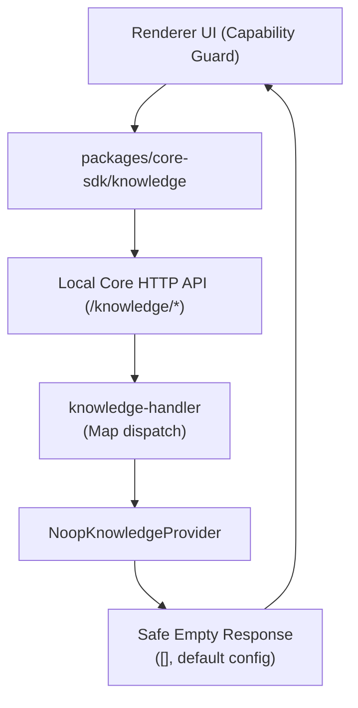

# Knowledge Runtime Architecture

Knowledge runtime 原先通过 Local AI Core plugin 接入外部向量数据库服务（`ai_vector`）。目前已彻底移除外部向量数据库引擎模块，Knowledge runtime 统一收敛为内置轻量 `knowledge.noop` 兜底，内核能力快照声明 `adapters.knowledge: false`，消除外部向量服务依赖并大幅简化代码架构。

## 职责边界

| 模块 | 关键文件 | 职责 |
| --- | --- | --- |
| Knowledge plugin | `services/local-ai-core/src/plugins/builtin/knowledge-noop-plugin.ts` | 提供默认的 Noop 兜底知识库插件。 |
| Noop Provider | `packages/knowledge-api/src/index.ts` | 提供安全的空操作与默认配置返回，无外部网络依赖。 |
| Controller API | `services/local-ai-core/src/runtime/handlers/knowledge-handler.ts` | 将 knowledge HTTP 路由映射到 KnowledgeRuntime provider。 |

## API 请求流程 (Noop 兜底)

## 运行时行为

AgentDock 彻底剥离了外部向量数据库依赖（Qdrant / `ai_vector`），系统能力快照恒定声明 `adapters.knowledge: false`：

- 查询类 API 恒定返回安全空数组（`[]`）或默认空配置，不发起任何外部网络请求。
- 创建、上传、向量检索等写操作在 Noop Provider 中直接抛出不可用异常或返回空结果。
- 前端渲染层通过 `useRuntimeFeatureSupport()` 读取 `knowledgeModule: false`，自动隐藏知识库导航与聊天输入框选择器。

## 变更规则

- 系统不再依赖任何外部向量数据库或远程嵌入服务。
- 知识库能力通过内核插件能力快照暴露（当前默认保持禁用）。
- 前端交互通过 `features.knowledgeModule` 统一守卫，不侵入核心 ACP 会话与 SQLite 实体模型。
