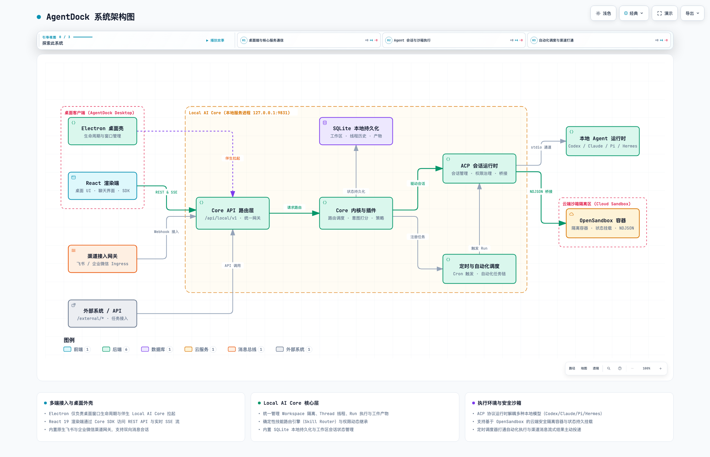

# AgentDock Architecture

## Summary

AgentDock now runs as a Local AI Core-first desktop app:

- Electron is only the desktop shell
- Local AI Core owns runtime, threads, streaming, knowledge, scheduler state, native channel ingress, sandbox launch, and external run mappings
- The renderer talks to Local AI Core APIs directly or through the Electron shell
- External systems can use Local AI Core APIs directly without driving renderer or Electron

There is no `cc-connect` runtime, management API, or bridge compatibility path in the active architecture.

架构事实与治理规范：
- 架构事实与系统边界：[docs/architecture.md](../architecture.md)
- 架构维护策略：[docs/architecture/maintenance.md](maintenance.md)
- 图表 Provider 配置：[docs/architecture/diagram-provider.yaml](diagram-provider.yaml)
- 语义变更历史：[docs/architecture/changes/](changes/)

## Top-Level Flow

  <picture>
    <source media="(prefers-color-scheme: dark)" srcset="system-architecture.dark.png">
    
  </picture>

> 💡 **交互式架构图**：可在浏览器中打开 [system-architecture.html](system-architecture.html)，体验深浅色切换、分步引导导览（01 桌面通信 / 02 会话与沙箱 / 03 调度与渠道）、节点高亮与路径追踪。

## 架构资产矩阵 (Architecture-as-Code Matrix)

AgentDock 采用 Archify 建立多层活文档架构资产矩阵，并通过 `pnpm lint:arch` 在持续集成中严格校验：

| 层级 | 领域 / 模块 | 图表类型 | 交付物 (HTML / 图像) | 规范源文件 (JSON) | 对应设计文档 |
|---|---|---|---|---|---|
| **L1 全局系统** | 端到端系统架构 | `architecture` | [交互全景图](system-architecture.html) · [PNG](system-architecture.png) | [`system-architecture.json`](system-architecture.json) | [架构总览](overview.md) |
| **L2 核心流程** | 定时调度与渠道主动投递 | `workflow` | [调度工作流](scheduled-delivery-workflow.html) · [PNG](scheduled-delivery-workflow.png) | [`scheduled-delivery-workflow.json`](scheduled-delivery-workflow.json) | [定时投递架构](scheduled-delivery.md) |
| **L2 核心流程** | ACP 会话与沙箱桥接时序 | `sequence` | [通信时序图](acp-session-flow.html) · [PNG](acp-session-flow.png) | [`acp-session-flow.sequence.json`](acp-session-flow.sequence.json) | [ACP 协议运行时](acp-protocol.md) |
| **L2 核心流程** | 确定性技能路由与工具索引 | `workflow` | [路由工作流](skill-router.html) · [PNG](skill-router.png) | [`skill-router.workflow.json`](skill-router.workflow.json) | [Core 内核与插件](local-core-kernel.md) |
| **L3 状态模型** | Agent Run 执行状态机 | `lifecycle` | [状态转移图](agent-run-lifecycle.html) · [PNG](agent-run-lifecycle.png) | [`agent-run.lifecycle.json`](agent-run.lifecycle.json) | [状态所有权](state-ownership.md) |

## Main Layers

### Renderer

- lives in `src/`
- renders Dashboard, Workspace, Threads, Knowledge
- consumes Local AI Core runtime and SSE events

### Electron

- lives in `electron/`
- opens the desktop window
- starts Local AI Core as a local companion process
- does not own chat routing or platform gateway logic

### Local AI Core

- lives in `services/local-ai-core/`
- exposes `/api/local/v1/*`
- owns thread routing, SQLite persistence, ACP streaming, scheduler execution, channel ingress/delivery, sandbox launch, and external API mappings

Local AI Core exposes external run APIs under `/api/local/v1/external/*`:

- `POST /external/projects` creates or reuses an external workspace mapping.
- `POST /external/runs` ensures the workspace/thread, sends the prompt, and returns the run id and per-run SSE URL.
- `GET /external/runs/:runId/events` streams the run snapshot and bridge updates for that run.

Cloud sandbox mode is configured on projects and materialized at runtime:

- sandbox providers select OpenSandbox connection details and auth env.
- runtime images select the agent ACP image, bridge transport, ports, and mount paths.
- Local AI Core mounts workspace and agent state, starts the sandbox through OpenSandbox, and communicates with the container through HTTP NDJSON ACP.

Local AI Core keeps scheduler responsibilities split by lifecycle:

- `ScheduledJobApplicationService` resolves scheduled job create/update input and derives channel routes from thread bindings.
- `SchedulerService` owns due polling, run concurrency, and adapter selection.
- `ScheduledConversationExecutor` turns a scheduled job into an ACP conversation and injects the channel runtime environment for the run.
- `channel-execution-policy.ts` resolves same-thread or side-thread targets for channel jobs.
- `ScheduledBridgeSession` binds the scheduled ACP session to the channel route so Lark/Weixin process updates, tool progress, permission cards, and final replies stream through channel gateways.
- Platform scheduler adapters select delivery mode. Local uses `thread-only`; Lark/Weixin use `bridge-stream` while preserving instance ids for delivery.

See [Scheduled Delivery Architecture](scheduled-delivery.md) for the full route and delivery model.

See [Cloud Sandbox And External Agent API](cloud-sandbox-and-external-api.md) for sandbox launch, external workspace mapping, and per-run SSE details.

### Shared Packages

- `packages/contracts`: shared API and data contracts
- `packages/core-sdk`: Local AI Core browser client
- `packages/knowledge-api`: knowledge abstraction and noop fallback runtime
- `packages/plugin-sdk`: plugin, agent runtime, channel, scheduler, monitor, and sandbox launch contracts

## Runtime Model

The renderer uses one of two local providers:

- `electron`: desktop shell is available
- `local_core`: direct Local AI Core access is available

Both providers target the same Local AI Core API surface.
