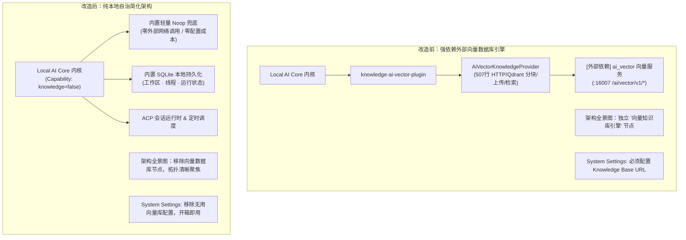

# Plan: 去掉向量数据库引擎模块，简化代码架构

- **Task Slug**: `remove-vector-database-engine`
- **Date**: `2026-09-05`
- **Spec**: [docs/specs/2026-09-05-remove-vector-database-engine.md](../specs/2026-09-05-remove-vector-database-engine.md)

## 方案架构示意图

## 实施步骤（按顺序执行）

### Step 1: 编写/更新测试建立基线 (TDD - RED)
- 新增 `packages/knowledge-api/test/noop-provider.test.ts`：覆盖 `createNoopKnowledgePlugin` 与 `NoopKnowledgeProvider`，确保返回安全默认值。
- 更新 `tests/electron/plugin-kernel.test.ts`：更新对 `adapters.knowledge` (期望 `false`) 与 `adapters.knowledgeProviders` (期望 `[]`) 的断言，验证其在未收敛实现时变红。

### Step 2: 物理删除向量数据库引擎模块核心实现 (GREEN - Part 1)
- 删除 `packages/knowledge-api/src/ai-vector-provider.ts`。
- 删除 `packages/knowledge-api/test/ai-vector-provider.test.ts`。
- 更新 `packages/knowledge-api/src/index.ts`：清理向量引擎导出，只保留 Noop 与默认配置工具。
- 删除 `services/local-ai-core/src/plugins/builtin/knowledge-ai-vector-plugin.ts`。

### Step 3: 收敛 Local AI Core 内核装配 (GREEN - Part 2)
- 修改 `services/local-ai-core/src/plugins/builtin/catalog.ts`：移除向量插件，统一返回 `createBuiltinNoopKnowledgePlugin()`。
- 修改 `services/local-ai-core/src/kernel/bootstrap.ts`：确保 capability snapshot 默认返回 `knowledge: false`，`knowledgeProviders: []`。

### Step 4: 前端界面与配置瘦身 (GREEN - Part 3)
- 修改 `src/pages/System/Config.tsx`：移除 "Knowledge base URL" 卡片及对应 state 与请求处理。
- 修改 `src/pages/Threads/ThreadChatComposer.tsx`：在渲染知识库选择器时结合 `features.knowledgeModule` 状态，当禁用时不显示该按钮。

### Step 5: 架构资产与文档同步 (Architecture & Docs Sync)
- 修改 `docs/architecture/system-architecture.json`：移除 `knowledge` 节点、`kernel-to-knowledge` 连线、边界 wrap 引用并更新卡片。
- 运行 `pnpm lint:arch` 确保 9 项 showcase 规则通过。
- 重新生成 `docs/architecture/system-architecture.html`。
- 同步更新 `docs/architecture/knowledge-runtime.md` 与 `docs/architecture/overview.md`。

### Step 6: 完整门禁验证与 QA (Refactor & QA)
- 运行 `pnpm typecheck`：验证类型系统。
- 运行 `pnpm lint:gates`：验证循环依赖、复制率、死代码与圈复杂度。
- 运行 `pnpm test`：运行全量测试套件，确认 100% 绿灯。

## Docs Impact
- `docs/architecture/system-architecture.json`：已下线独立 `knowledge`（向量知识库引擎）数据库节点与 `kernel-to-knowledge`（向量检索）连线，更新边界与说明卡片。
- `docs/architecture/system-architecture.html`：已通过 Archify deliver 重新生成并校验通过（9/9 checks passed）。
- `docs/architecture/knowledge-runtime.md`：已更新职责边界与运行时说明，明确已移除外部向量引擎，收敛为内置 Noop 兜底。
- `docs/architecture/overview.md`：已更新 `@cc/knowledge-api` 的描述为纯净的 Noop 抽象。
- `README.md`：在 `## New` 区域记录了 `2026-09-05` 架构下线外部向量数据库引擎并自治降维的用户可见说明。
